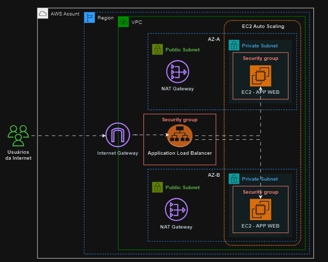
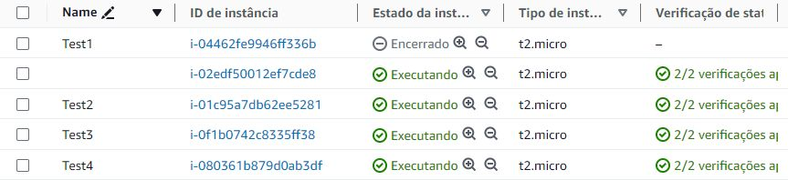
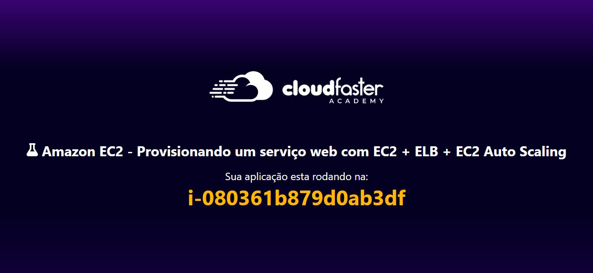

# Trabalhando com os serviços da AWS como:

- Amazon VPC
- Amazon EC2
- Security Groups
- Balanceadores de carga (ALB)
- EC2 Auto Scaling

#

#

#### Evento: Arquiteto de Valor Cloud da CloudFaster Academy, ministrado pelo Dan Rezende.
